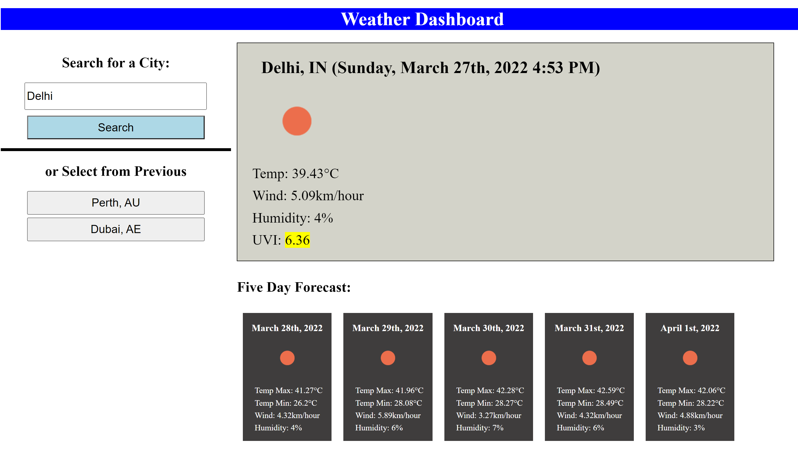

# Weather-Guide
A webpage that will allow users to check the weather in any city.

## Description
Users can enter a city into the search box, and the current weather in that city will be returned, along with a five day forecast.  After searching for a city, the city is added to a list below the search box that persists between uses.  To return to a previously viewed city, the User can just click in the list below the search box to see updated weather for that city.

## Usage
When first opened, users are presented with a City search box in the top left, and an empty pane on the right for display of the current weather in the chosen City.  After entering a city, the page makes a call to the "openweathermap.org" API to get the weather.  If invalid data is entered, nothing happens until a city is entered.

The API will return the current weather, which is displayed in a large pain on the top right, and the five day forecast, which is presented below the current weather.  The city is then added to the list of cities previously searched, which appears below the search box.  

When the User next visits or refreshes the page, the list of previously searched cities will show below the search box and the User can just click on a previously saved city to see an updated weather forecast.  Valid cities are able to persist in the list, as they are saved to and retrieved from local storage.

The webpage is located at this address:  https://cancer2806.github.io/Weather-Guide/ and screenshots of the webpage are provided below.  The first shot shows a moderate UVI rating (yellow background) Delhi and the second shot shows a low UVI rating for Dublin (green) - Delhi can be seen in the previously searched cities list:

  
 
 

CSS is contained in: 
  ./assets/css/style.css is used for styling the webpage

JS is contained in: 
  ./assets/js/script.js and holds all the JS code

## Credits
Repository for the submission of Week 6's Homework in UWA's Bootcamp series.

Openweathermap (https://openweathermap.org/api) was used to provide the weather data.

Moment.js (https://momentjs.com/) was used to format the dates provided from the API.

## License
An API key is required to access the weather data.
